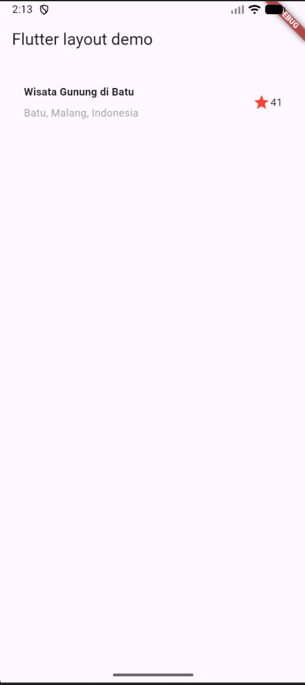
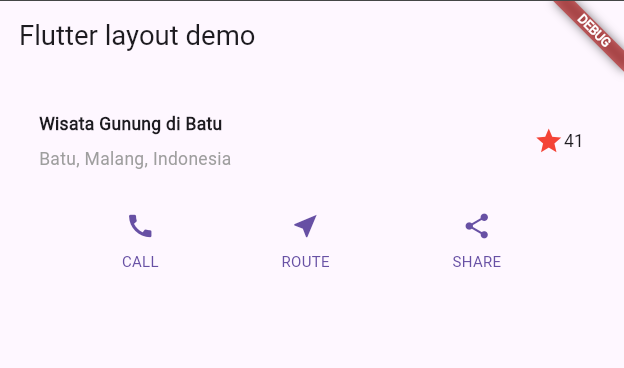
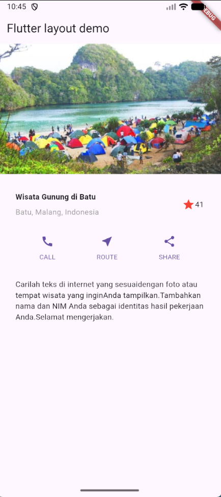
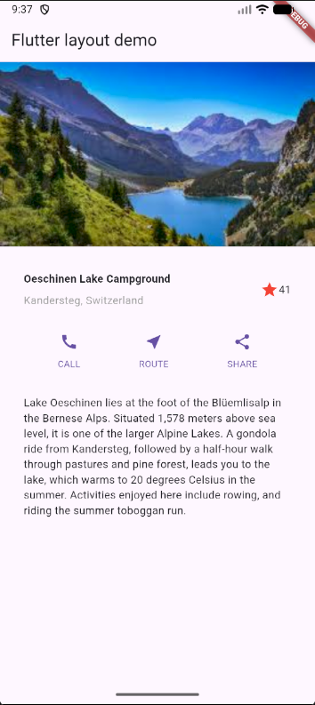
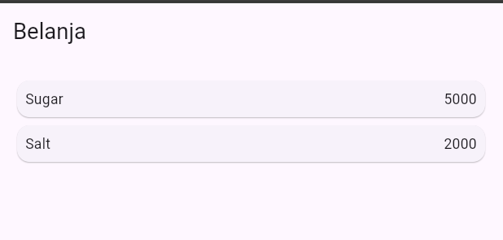

# Laporan Praktikum Layout dan Navigasi Flutter

**Nama:** Nafilah Firyal Hana
**NIM:** 244107060047

## Praktikum 1: Membangun Layout di Flutter

**Penjelasan:**
Pada langkah awal ini, tata letak aplikasi dipecah menjadi elemen dasar menggunakan widget `Row` dan `Column`. Pembuatan bagian judul (*title section*) dilakukan dengan menyusun teks dan ikon bintang di dalam `Container` guna memberikan *padding*. Elemen-elemen tersebut diatur agar dapat mengisi sisa ruang secara proporsional menggunakan bantuan widget `Expanded`.

## Praktikum 2: Implementasi Button Row

**Penjelasan:**
Tahap ini berfokus pada penambahan baris tombol interaktif (Call, Route, Share) di bawah bagian judul. Untuk menjaga agar kode tetap rapi dan *reusable*, sebuah *method* terpisah bernama `_buildButtonColumn` diimplementasikan. *Method* ini bertugas merender setiap kolom tombol beserta ikon dan teksnya. Jarak antar tombol diatur secara merata menggunakan properti `MainAxisAlignment.spaceEvenly`.

## Praktikum 3: Implementasi Text Section

**Penjelasan:**
Bagian deskripsi wisata ditambahkan di bawah baris tombol. Teks dibungkus di dalam widget `Container` dengan konfigurasi *padding* sebesar 32 piksel pada seluruh sisinya. Selain itu, properti `softWrap: true` diaktifkan agar teks dapat otomatis turun ke baris baru ketika mencapai batas lebar layar, sehingga paragraf tetap utuh dan tidak terpotong.

## Praktikum 4: Implementasi Image Section & Struktur ListView

**Penjelasan:**
Penyempurnaan visual dilakukan dengan menyisipkan aset gambar (`lake.jpg`) pada bagian paling atas antarmuka. Penyesuaian gambar menggunakan `BoxFit.cover` diterapkan agar gambar dapat memenuhi area secara proporsional tanpa merusak rasio aslinya.

Langkah krusial pada tahap ini adalah memodifikasi properti `body` pada `Scaffold`. Keseluruhan struktur *widget* yang sebelumnya dibungkus menggunakan `Column` diubah menjadi `ListView`. Modifikasi ini sangat penting agar antarmuka menjadi responsif dan mendukung fitur *scroll* dinamis, terutama saat aplikasi dijalankan pada perangkat dengan resolusi layar yang lebih kecil.

## Tugas Praktikum 1: Project `basic_layout_flutter`

**Penjelasan:**
Tugas ini mengimplementasikan tata letak dasar aplikasi sesuai panduan. Antarmuka profil wisata Oeschinen Lake dibangun dengan pendekatan modular, membagi tata letak menjadi empat *widget* terpisah agar struktur kode lebih rapi:

1. **Image Section:** Menampilkan gambar utama menggunakan `BoxFit.cover`.
2. **Title Section:** Menyusun nama lokasi dan rating bintang menggunakan kombinasi `Row`, `Column`, serta `Expanded` untuk mengisi sisa ruang.
3. **Button Section:** Menggunakan `Row` dengan `MainAxisAlignment.spaceEvenly` untuk menata tiga tombol interaktif secara sejajar dan merata.
4. **Text Section:** Menampilkan paragraf deskripsi dengan tambahan `Padding` dan properti `softWrap: true` agar teks menyesuaikan lebar layar.

Seluruh komponen di atas disusun secara vertikal di dalam `Column` utama, yang kemudian dibungkus menggunakan `SingleChildScrollView` agar halaman mendukung fitur *scroll* dan terhindar dari *overflow* pada layar berukuran kecil.

## Praktikum 5: Membangun Navigasi di Flutter

Pada praktikum ini, dilakukan pembelajaran mengenai pembangunan aplikasi bergerak multi-halaman. Fokus utamanya adalah memahami mekanisme *routing* dan bagaimana cara mengirimkan data dari satu halaman ke halaman lainnya menggunakan rute yang telah didefinisikan secara unik.

**Poin Utama Praktikum:**
* **Definisi Route:** Mengatur rute aplikasi di `main.dart` menggunakan `initialRoute` dan `routes`.
* **Pemodelan Data:** Membuat class model `Item` untuk menampung atribut nama dan harga produk.
* **ListView:** Menampilkan data produk secara vertikal menggunakan `ListView.builder`.
* **Interaksi User:** Menggunakan widget `InkWell` untuk mendeteksi sentuhan pada kartu produk dan memicu perpindahan halaman melalui `Navigator.pushNamed`.

## Tugas Praktikum 2: Pengembangan Marketplace (Custom Layout & Navigasi)

Tugas ini merupakan tahap pengembangan lebih lanjut dari aplikasi belanja sebelumnya dengan menerapkan desain yang lebih kompleks serta teknologi navigasi yang lebih modern.

### Hasil Implementasi
| Halaman Utama (GridView) | Halaman Detail (ItemPage) |
| :---: | :---: |
|  |  |

### Fitur dan Modifikasi:
1.  **Pembaruan Model Data:** Menambahkan atribut pendukung produk berupa `imageUrl` (foto), `stock` (stok), dan `rating` untuk mensimulasikan data marketplace yang nyata.
2.  **Transformasi Layout (GridView):** Mengubah tampilan `ListView` menjadi `GridView` (2 kolom) untuk memberikan visualisasi produk yang lebih menarik dan efisien ruang, menggunakan `SliverGridDelegateWithFixedCrossAxisCount`.
3.  **Hero Animation:** Mengimplementasikan widget `Hero` pada setiap gambar produk. Fitur ini memberikan efek transisi visual yang halus di mana gambar terlihat "terbang" dan membesar saat berpindah dari halaman daftar ke halaman detail.
4.  **Navigasi dengan `go_router`:** Melakukan migrasi sistem navigasi dari Navigator bawaan ke *plugin* `go_router`. Pengiriman data (*passing data*) antar halaman dikelola melalui parameter `extra`.
5.  **Refactoring Widget:** Memecah kode menjadi widget-widget yang lebih kecil (seperti `ItemCard`) untuk meningkatkan keterbacaan kode dan memudahkan proses pemeliharaan (*maintenance*).
6.  **Identitas Mahasiswa:** Menambahkan *footer* pada `HomePage` menggunakan `BottomAppBar` yang menampilkan nama dan NIM sebagai identitas pengerjaan tugas.