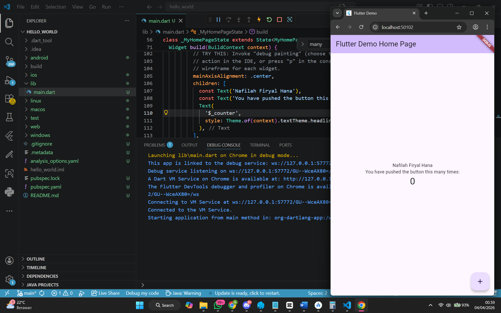
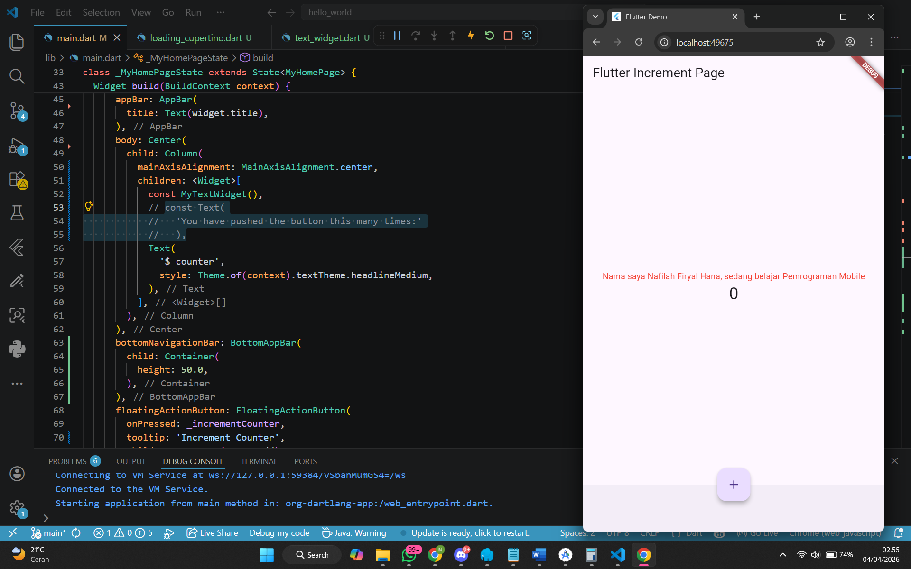
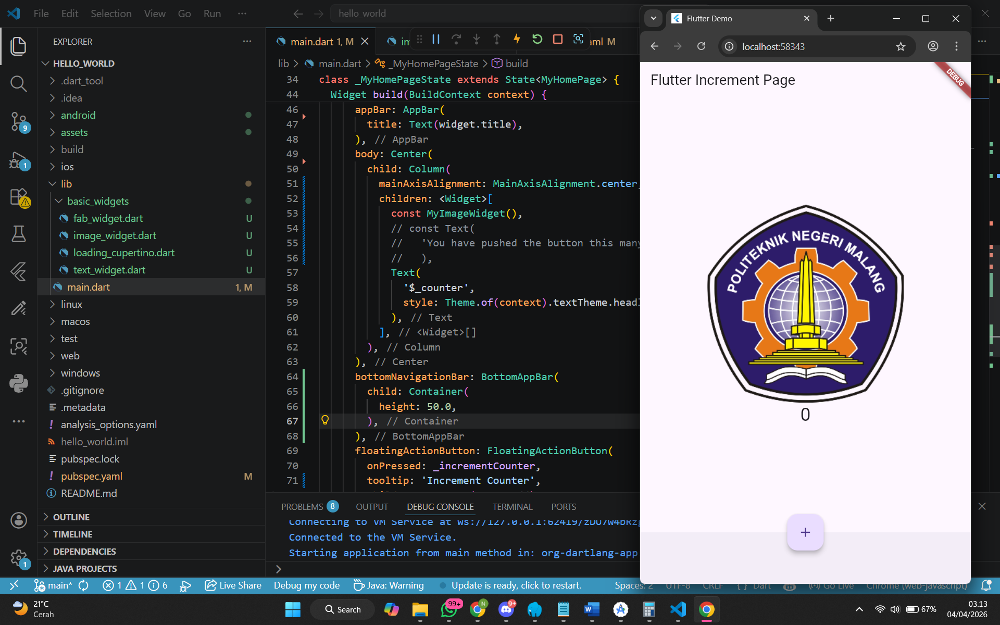
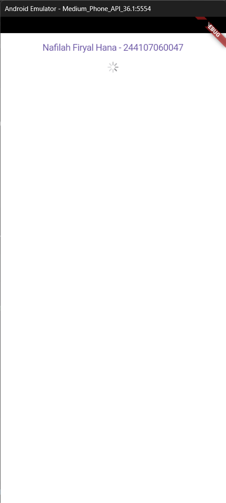
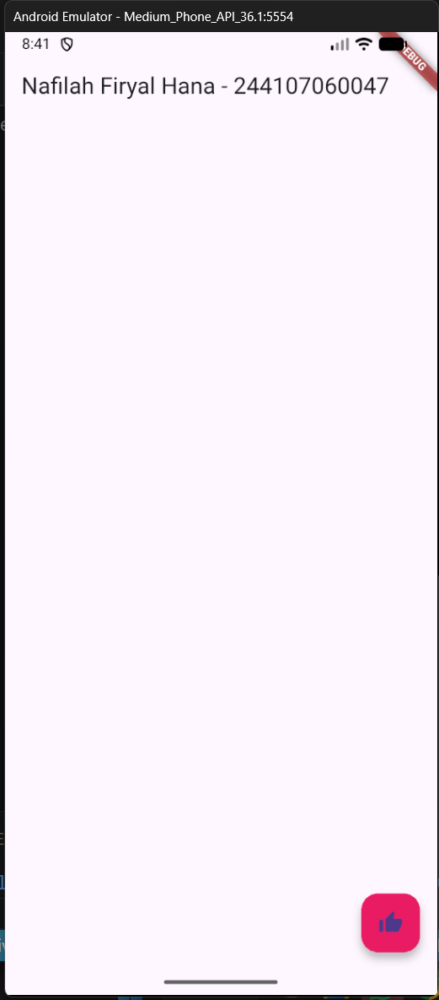
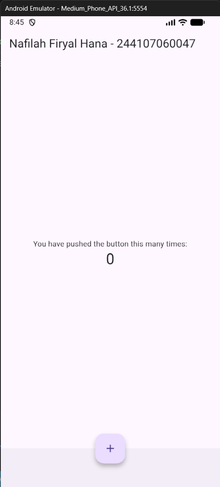
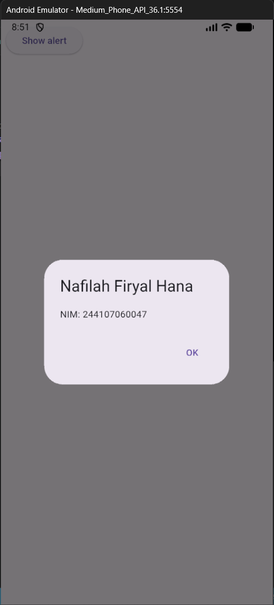
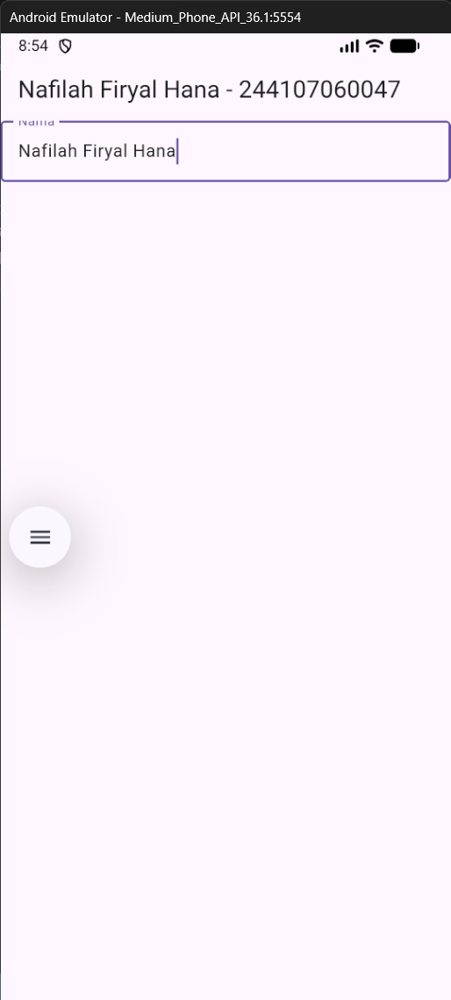
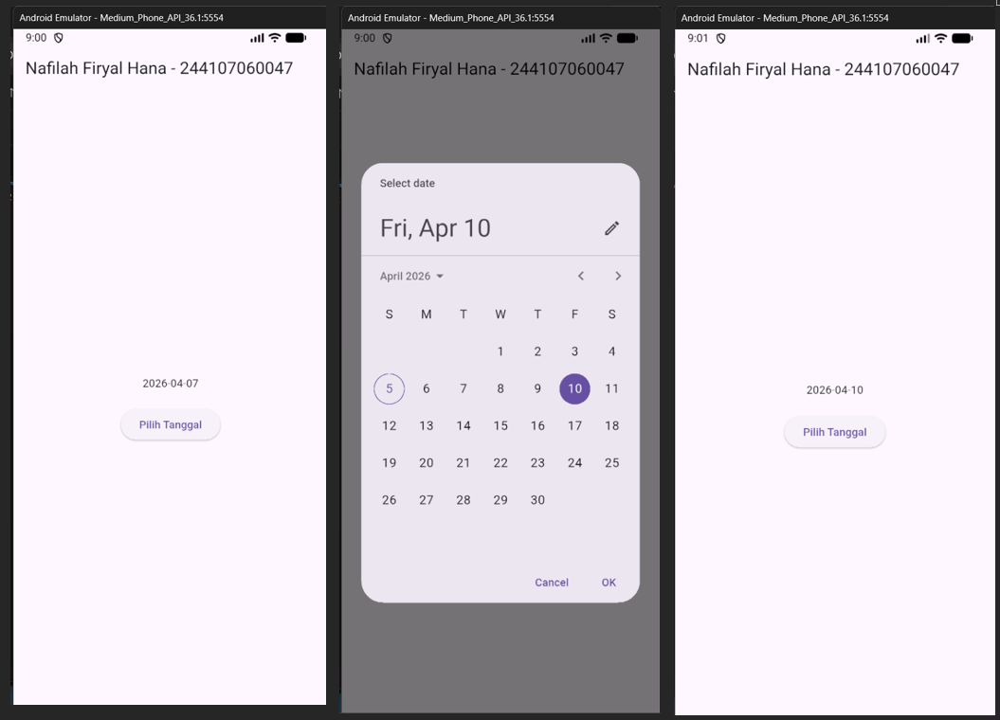
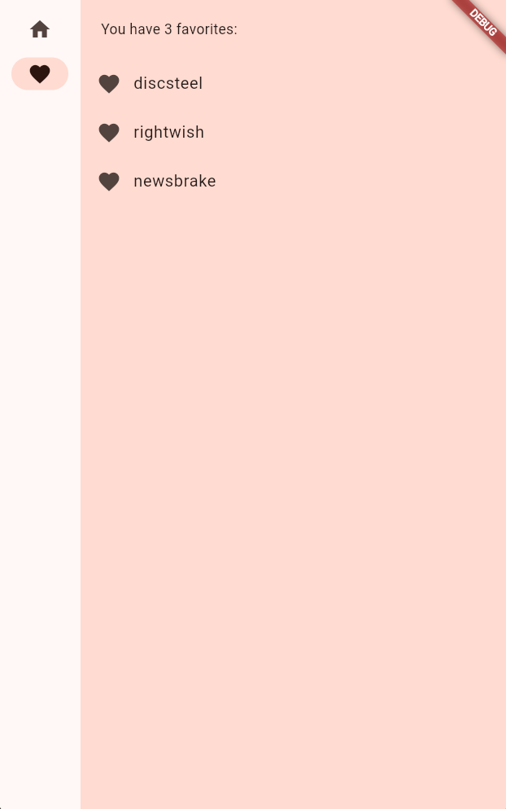

# hello_world

A new Flutter project

# Praktikum 4: Menerapkan Widget Dasar

Pada praktikum ini, saya mempelajari cara membuat dan menggunakan widget dasar pada Flutter. Agar kode lebih rapi, setiap widget dipisahkan ke dalam filenya masing-masing di dalam folder `basic_widgets`.

## 1. Text Widget
Membuat file `text_widget.dart` yang berisi widget `Text` untuk menampilkan nama lengkap. Teks tersebut juga diberikan sedikit desain menggunakan `TextStyle` agar berwarna merah, berukuran font 14, dan berposisi di tengah layar.

**Hasil Text Widget:**
 

---

## 2. Image Widget
Membuat file `image_widget.dart` untuk menampilkan gambar logo polinema. Sebelum dipanggil menggunakan `AssetImage`, gambar dimasukkan ke dalam folder `assets` dan didaftarkan terlebih dahulu ke dalam file konfigurasi `pubspec.yaml` agar dikenali oleh sistem.

**Hasil Image Widget:**

## Praktikum 5: Widget Material Design & iOS Cupertino

### Langkah 1: Cupertino Button dan Loading Bar

> **Penjelasan:** Mengimplementasikan antarmuka khas iOS (Apple). Terdapat `CupertinoButton` yang berupa teks tanpa *border*, dan `CupertinoActivityIndicator` berupa animasi putaran garis-garis pemuatan. Teks telah disesuaikan dengan Nama dan NIM.

### Langkah 2: Floating Action Button (FAB)

> **Penjelasan:** Menambahkan `FloatingActionButton` berwarna merah muda dengan ikon jempol di pojok kanan bawah layar aplikasi, lengkap dengan baris judul AppBar berisi Nama dan NIM.

### Langkah 3: Scaffold Widget

> **Penjelasan:** Menerapkan struktur tata letak dasar Material Design menggunakan `Scaffold`. Widget ini dilengkapi dengan `AppBar` di atas, `BottomAppBar` di bawah, konten teks di tengah layar, dan FAB yang posisinya digeser ke tengah-bawah (`centerDocked`).

### Langkah 4: Dialog Widget 

> **Penjelasan:** Membuat interaksi *pop-up*. Hasilnya menampilkan tombol `Show alert` kemudian ketika tombol tersebut ditekan maka muncul `AlertDialog` yang memuat teks Nama dan NIM beserta tombol aksi "OK" untuk menutup dialog.

### Langkah 5: Input dan Selection Widget

> **Penjelasan:** Mengimplementasikan widget `TextField` untuk menerima input ketikan dari pengguna. Gambar menunjukkan interaksi saat pengguna mengetikkan teks ke dalam kolom berlabel "Nama Lengkap".

### Langkah 6: Date and Time Pickers

> **Penjelasan:** Menggunakan widget pemilih tanggal interaktif. Saat tombol "Pilih Tanggal" ditekan, fungsi `showDatePicker` dipanggil untuk menampilkan kalender *pop-up*. Tanggal yang dipilih akan memperbarui *state* dan menampilkannya di tengah layar.

## Tugas Praktikum: Codelabs First Flutter App

> **Penjelasan:** Aplikasi pembuat kata acak (Namer App). Aplikasi ini memiliki fitur *generate* kata baru, tombol *like* untuk menyimpan kata favorit, dan halaman *Favorites* yang responsif terhadap perubahan ukuran layar.